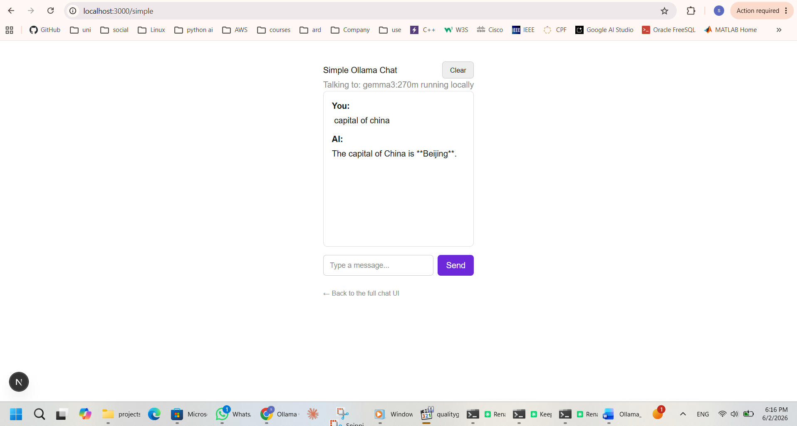
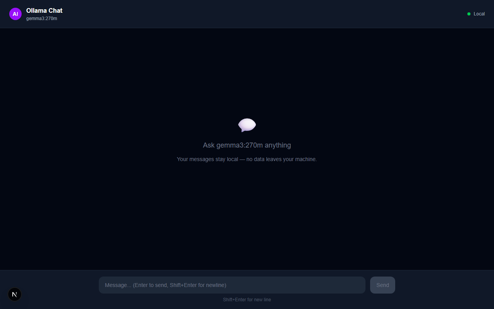

# Ollama Chat

A modern **Next.js + TypeScript** web app for chatting with AI models running locally via [Ollama](https://ollama.com). Full data privacy, offline capability, and zero API costs.

## Demo

### Simple Chat Interface


### Full Chat Interface


## Features

- **Two UI modes** — a polished full chat UI and a lightweight simple interface
- **Real-time streaming** — responses stream token by token as they are generated
- **Cancel mid-stream** — stop a response at any time with the Clear button
- **Local & private** — all inference runs on your machine via Ollama, no data leaves your device
- **Zero API costs** — no cloud subscriptions or API keys needed

## Requirements

- [Node.js](https://nodejs.org) 
- [Ollama](https://ollama.com) running locally on port `11434`
- A model pulled in Ollama, e.g. `ollama pull gemma3:270m`

## Getting Started

```bash
npm install
npm run dev
```

Then open [http://localhost:3000](http://localhost:3000) for the full chat UI, or [http://localhost:3000/simple](http://localhost:3000/simple) for the simple interface.

## Tech Stack

- [Next.js 16](https://nextjs.org) — React framework with App Router
- [TypeScript](https://www.typescriptlang.org) — strict type safety
- [Tailwind CSS v4](https://tailwindcss.com) — utility-first styling
- [Ollama](https://ollama.com) — local LLM inference
